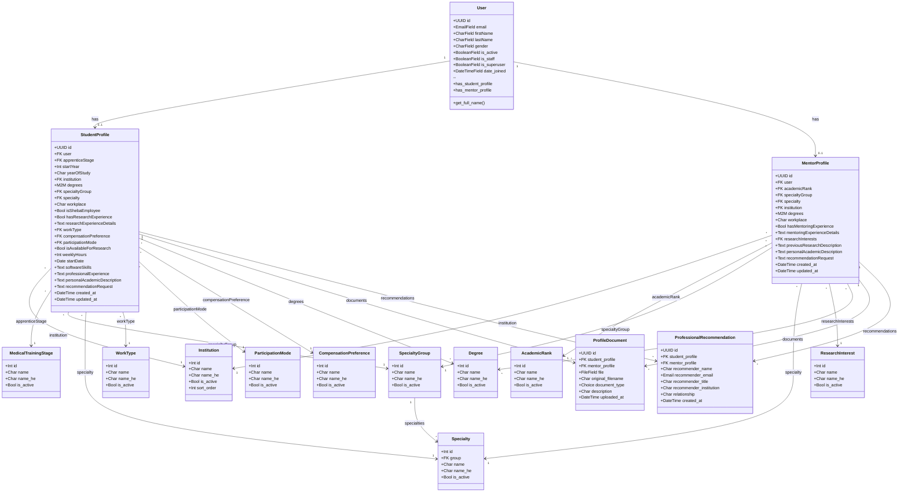

# ShebaHub Backend - UML Class Diagram
## Last Updated: January 1, 2026

---

## Reference Data Values (Seeded from Frontend)

### Institution (6 items)
| ID | name | name_he |
|----|------|---------|
| 1 | Hebrew University | האוניברסיטה העברית בירושלים |
| 2 | Tel Aviv University | אוניברסיטת תל אביב |
| 3 | Technion | הטכניון |
| 4 | Ben Gurion University | אוניברסיטת בן גוריון |
| 5 | Bar Ilan University | אוניברסיטת בר אילן |
| 6 | Ariel University | אוניברסיטת אריאל |

### Degree (5 items)
| name |
|------|
| MD |
| PhD |
| MSc |
| MPH |
| MBA |

### MedicalTrainingStage - For Students (7 items)
| name_he |
|---------|
| סטודנט |
| לפני סטאז׳ |
| סטאז׳ר |
| אחרי סטאז׳ |
| מתמחה |
| רופא מתמחה |
| אחר |

### AcademicRank - For Mentors (4 items)
| name_he |
|---------|
| סטאז׳ |
| מתמחה |
| מומחה/ית |
| התמחות-על |

### SpecialtyGroup (3 groups)
| name | Count |
|------|-------|
| base | 31 specialties |
| super | 34 specialties |
| fellows | 59 specialties |

### WorkType (3 items)
| name_he |
|---------|
| איסוף נתונים |
| כתיבה מדעית |
| ניתוח סטטיסטי |

### ParticipationMode (3 items)
| name_he |
|---------|
| פרונטלי |
| מרחוק |
| היברידי |

### CompensationPreference (4 items)
| name_he |
|---------|
| מלגה |
| שכר |
| קרדיט אקדמי |
| התנדבות |

### ResearchInterest (4 items)
| name_he |
|---------|
| AI ברפואה |
| אפידמיולוגיה |
| רפואה דחופה |
| מחקר קליני |

---

## Gender Values (User model)
| value | label |
|-------|-------|
| man | גבר |
| woman | אישה |
| other | אחר |

---

## Document Types (ProfileDocument)
| value | description |
|-------|-------------|
| CV | Curriculum Vitae |
| TRANSCRIPT | Academic Transcript |
| CERTIFICATE | Certificate |
| RECOMMENDATION | Recommendation Letter |
| OTHER | Other |
